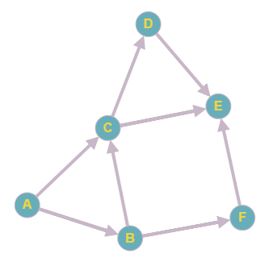

# Breadth-First Search
Breadth-first search (BFS) is an algorithm for traversing or searching tree or graph data structures. It starts at the tree root (or some arbitrary node of a graph, sometimes referred to as a 'search key'[1]), and explores all of the neighbor nodes at the present depth prior to moving on to the nodes at the next depth level.

## Key points
* BFS tells you if there's a path from A to B.
* If there's a path, BFS will find the shortest path.
* [Queue](15-queue) are used for implementing BFS.

## Implementation

Above graph will be used as an example to show how BFS works. [Adjacency matrix](19-breadth-first-search/graph.in) is used as input for BFS.

**Input:**
- Adjacency matrix
- Start Vertex
- End Vertex

**Output:**
- `Shortest path` from start vertext to end vertex
- `false` in case if there is no such path

### Resources
* https://en.wikipedia.org/wiki/Breadth-first_search
* http://graphonline.ru/en/
