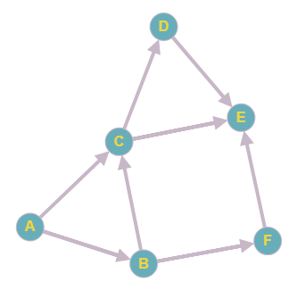

# Depth-First Search
Depth-first search (DFS) is an algorithm for traversing or searching tree or graph data structures. The algorithm starts at the root node (selecting some arbitrary node as the root node in the case of a graph) and explores as far as possible along each branch before backtracking.

Stack are used to implement DFS

## Applications
Algorithms that use depth-first search as a building block include:
- Topological sorting
- Maze generation may use a randomized depth-first search
- Finding the bridges of a graph
- Finding connected components
- Planarity testing

## Implementation

Above graph will be used as an example to show how BFS works.

**Input:**
- Adjacency list
- Start Vertex
- End Vertex

**Output:**
- Connection path between 2 nodes
- `false` in case if there is no such path

### Resources
* https://en.wikipedia.org/wiki/Depth-first_search
