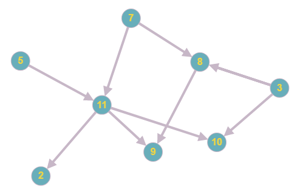

# Topological Sort
Topological sorting for Directed Acyclic Graph (DAG) is a linear ordering of vertices such that for every directed edge uv, vertex u comes before v in the ordering. Topological Sorting for a graph is not possible if the graph is not a DAG.

## Applications
Topological Sorting is mainly used for scheduling jobs from the given dependencies among jobs. In computer science, applications of this type arise in instruction scheduling, ordering of formula cell evaluation when recomputing formula values in spreadsheets, logic synthesis, determining the order of compilation tasks to perform in makefiles, data serialization, and resolving symbol dependencies in linkers.

## Implementation

Above graph will be used as an example to show how topological sort works.

**Input:**
- Adjacency list

**Output:**
- topological sort for a given DAG
- error if graph has at least one cycle

### Resources
* https://en.wikipedia.org/wiki/Topological_sorting
* https://www.geeksforgeeks.org/topological-sorting/
