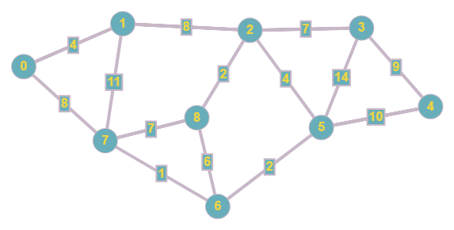

# Dijkstra's Algorithm
Dijkstra's algorithm is an algorithm for finding the shortest paths between nodes in a graph, which may represent, for example, road networks.

## Key points
* Dijkstra's algorithm is used to calculate the shortest path for a weighted graph.
* The graph can either be directed or undirected.
* Dijkstra's algorithm works when all the weights are positive.
* If you have negative weights, use the Bellman-Ford algorithm.

## Implementation

Above graph will be used as an example to show how Dijkstra's algorithm work.

**Input:**
- Adjacency matrix
- Start Vertex

**Output:**
- Array of nodes with distances

### Resources
* https://en.wikipedia.org/wiki/Dijkstra%27s_algorithm
* https://www.geeksforgeeks.org/dijkstras-shortest-path-algorithm-greedy-algo-7/
* https://brilliant.org/wiki/dijkstras-short-path-finder/
* https://graphonline.ru/en/
