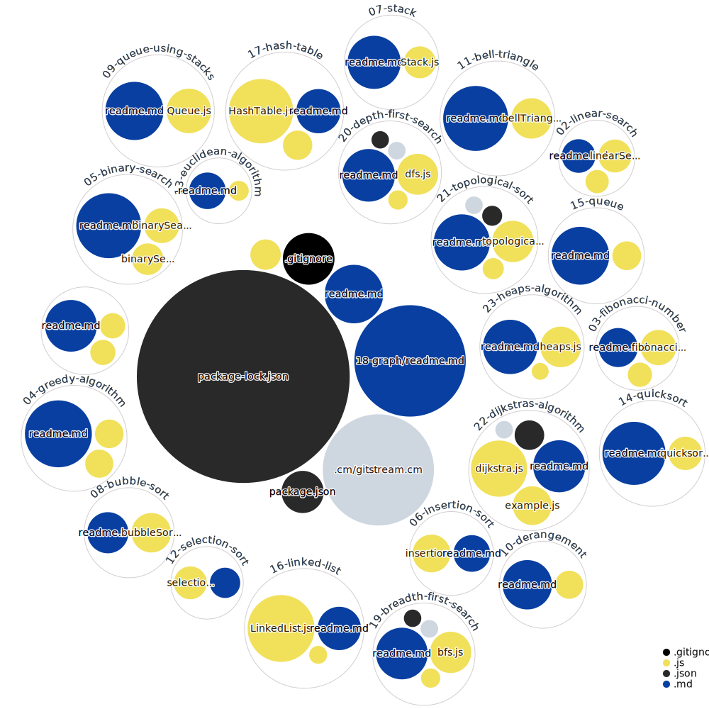

# Algorithms
Data Structures and Algorithms Challenges

## Contents
* [Ancient Egyptian Multiplication](01-ancient-egyptian-multiplication)
* [Linear Search](02-linear-search)
* [Fibonacci Number](03-fibonacci-number)
* [Greedy Algorithm (Minimum Numbers of Coins)](04-greedy-algorithm)
* [Binary Search](05-binary-search)
* [Insertion Sort](06-insertion-sort)
* [Stack](07-stack)
* [Bubble Sort](08-bubble-sort)
* [Implement Queue using Stacks](09-queue-using-stacks)
* [Derangement](10-derangement)
* [Bell Triangle](11-bell-triangle)
* [Selection Sort](12-selection-sort)
* [Euclidean Algorithm](13-euclidean-algorithm)
* [Quicksort](14-quicksort)
* [Queue](15-queue)
* [Linked List](16-linked-list)
* [Hash Table](17-hash-table)
* [Graph](18-graph)
* [Breadth-First Search](19-breadth-first-search)
* [Depth-First Search](20-depth-first-search)
* [Topological Sort](21-topological-sort)
* [Dijkstra's Algorithm](22-dijkstras-algorithm)
* [Heap's Algorithm](23-heaps-algorithm)

## Diagram

